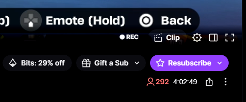

# QuickRec

[](https://github.com/dmytsuu/quick-rec/releases/latest)
[](https://github.com/dmytsuu/quick-rec/releases/latest/download/QuickRec.exe)
[](https://github.com/dmytsuu/quick-rec/releases/latest/download/QuickRec-extension.zip)

Windows system-tray app + Chrome extension that adds a **⏺ REC** button to Twitch streams. One click opens a new terminal window running `yt-dlp` for that channel.



## Requirements

- [yt-dlp](https://github.com/yt-dlp/yt-dlp) — must be in PATH
- Windows 10/11
- Google Chrome

## Install

### 1. Download

Grab both files from the [latest release](https://github.com/dmytsuu/quick-rec/releases/latest):
- `QuickRec.exe`
- `QuickRec-extension.zip`

### 2. Run the tray app

Launch `QuickRec.exe` — a green dot appears in the system tray. That's it.

> To start automatically with Windows: right-click the tray icon → **Start at Startup**.

### 3. Load the extension

1. Unzip `QuickRec-extension.zip` anywhere
2. Open `chrome://extensions`
3. Enable **Developer mode** (top right toggle)
4. Click **Load unpacked** → select the unzipped folder

Navigate to any Twitch channel — **⏺ REC** appears in the player controls bar.

## Tray menu

| Item | Action |
|---|---|
| ● Listening on :9999 | status indicator |
| Stop / Start Listening | toggle the HTTP server |
| Start at Startup | adds/removes from Windows startup |
| Quit | exit |

## How it works

```
[Chrome extension] ──click──▶ fetch http://127.0.0.1:9999/run?url=...
                                        │
                              [Go tray app — server]
                                        │
                              cmd /c start "" cmd /k yt-dlp <url>
                                        │
                              [new terminal window]
```

Server binds to `127.0.0.1` only — not reachable from outside the machine.  
Recordings saved to `%USERPROFILE%\Videos\TwitchVODs`.

## Build from source

Requires [Go 1.21+](https://go.dev/dl/).

```powershell
cd tray-app
go mod tidy
go build -ldflags="-H windowsgui" -o QuickRec.exe .
```

## File structure

```
quick-rec/
├── tray-app/
│   ├── main.go       Go tray app + HTTP server
│   └── go.mod
└── extension/
    ├── manifest.json
    └── content.js    injects REC button, handles SPA navigation
```
